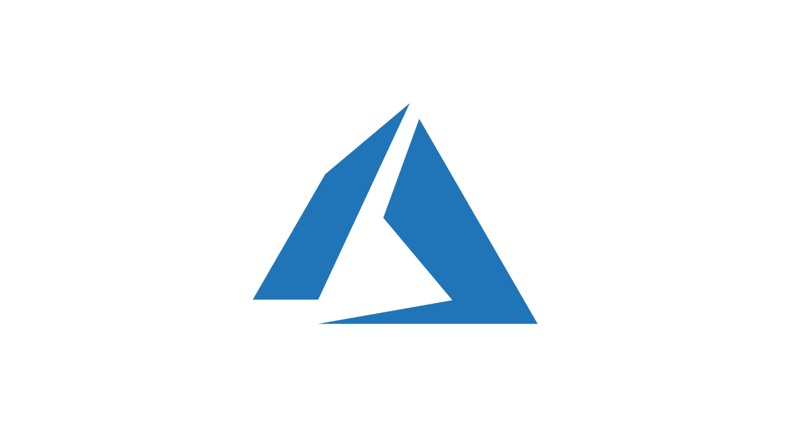
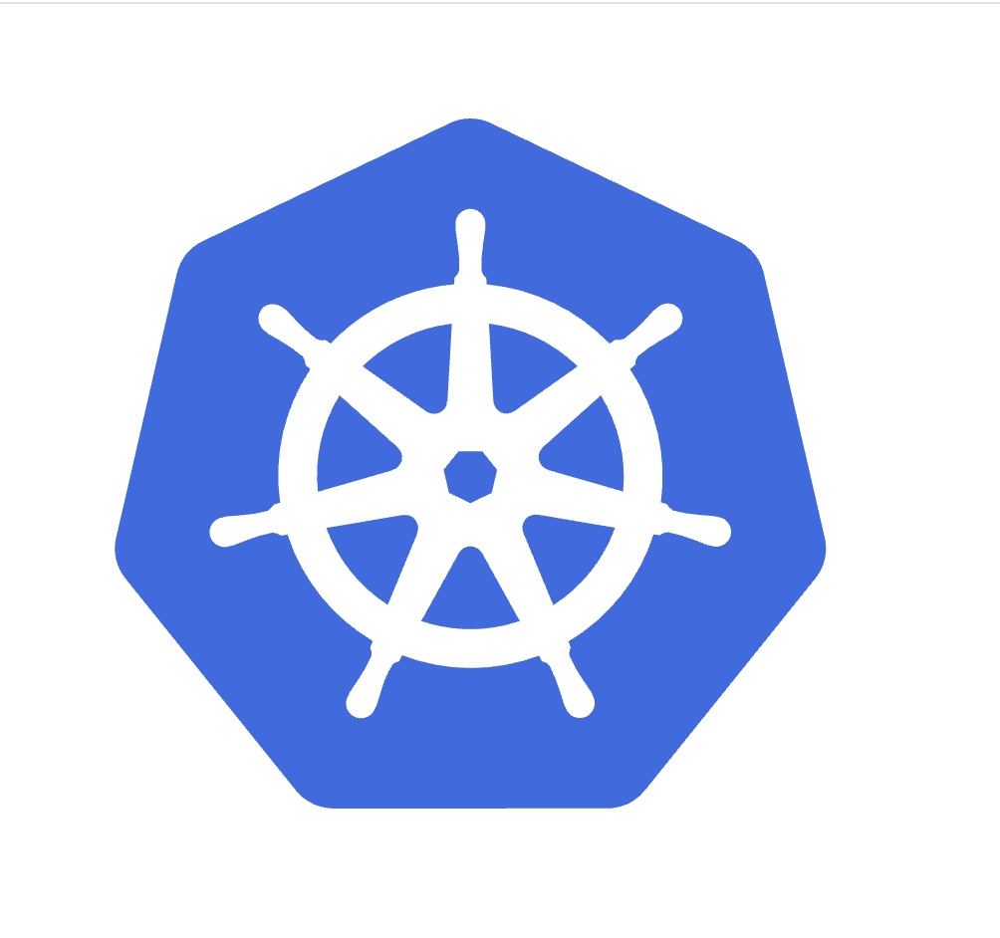

## Hi, there 👋 

#### I'm Technical Architect @ [Infinite Computer Solutions](https://www.infinite.com/)
Read about me at: https://www.lalitb.in/

#### Now
- ☸️  Currently working on AWS, [Kubernetes](https://kubernetes.io/), [GitHub Actions](https://docs.github.com/en/actions/get-started/quickstart), [Platform Engineering](https://platformengineering.org/)
- 🔭  Worked on [steampipe](https://steampipe.io/) open source project. 
- 📫  Reach me 

---

## 📊 Github Stats

    
    

 

 

---

## 🚀 My Skills

<table align="center">
  <tr>
    <td align="center" width="96">
      
       AWS
    </td>
    <td align="center" width="96">
      
       Azure
    </td>
    <td align="center" width="96">
      
       GCP
    </td>
    <td align="center" width="96">
      
       Go
    </td>
    <td align="center" width="96">
      
       JavaScript
    </td>
  </tr>
  <tr>
    <td align="center" width="96">
      
       Kubernetes
    </td>
    <td align="center" width="96">
      
       GitHub
    </td>
    <td align="center" width="96">
      
       Terraform
    </td>
    <td align="center" width="96">
      
       GitHub_Actions
    </td>
    <td align="center" width="96">
      
       Docker
    </td>
  </tr>
</table>

---

## ⚡ Certifications

- [AWS Certified Solutions Architect – Associate](https://www.credly.com/badges/cd161d44-dbd7-4999-b3ed-f56fbc1deeb7)
